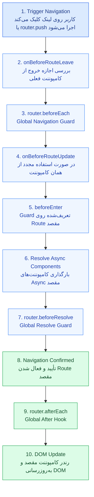

# Vue Router 4 — Navigation Cycle

```mermaid
flowchart TD
    A["1. Trigger Navigation<br/>کاربر روی لینک کلیک می‌کند یا router.push اجرا می‌شود"]
    B["2. onBeforeRouteLeave<br/>بررسی اجازه خروج از کامپوننت فعلی"]
    C["3. router.beforeEach<br/>Global Navigation Guard"]
    D["4. onBeforeRouteUpdate<br/>در صورت استفاده مجدد از همان کامپوننت"]
    E["5. beforeEnter<br/>Guard تعریف‌شده روی Route مقصد"]
    F["6. Resolve Async Components<br/>بارگذاری کامپوننت‌های Async مقصد"]
    G["7. router.beforeResolve<br/>Global Resolve Guard"]
    H["8. Navigation Confirmed<br/>تأیید و فعال شدن Route مقصد"]
    I["9. router.afterEach<br/>Global After Hook"]
    J["10. DOM Update<br/>رندر کامپوننت مقصد و به‌روزرسانی DOM"]

    A --> B --> C --> D --> E --> F --> G --> H --> I --> J

    classDef start fill:#dbeafe,stroke:#2563eb,color:#1e3a8a
    classDef guard fill:#eff6ff,stroke:#3b82f6,color:#1e40af
    classDef success fill:#dcfce7,stroke:#16a34a,color:#14532d

    class A start
    class B,C,D,E,F,G guard
    class H,I,J success
```
